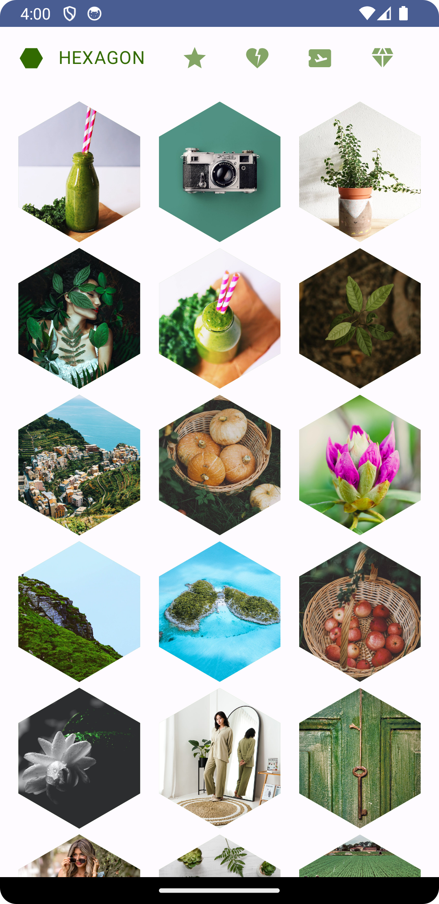
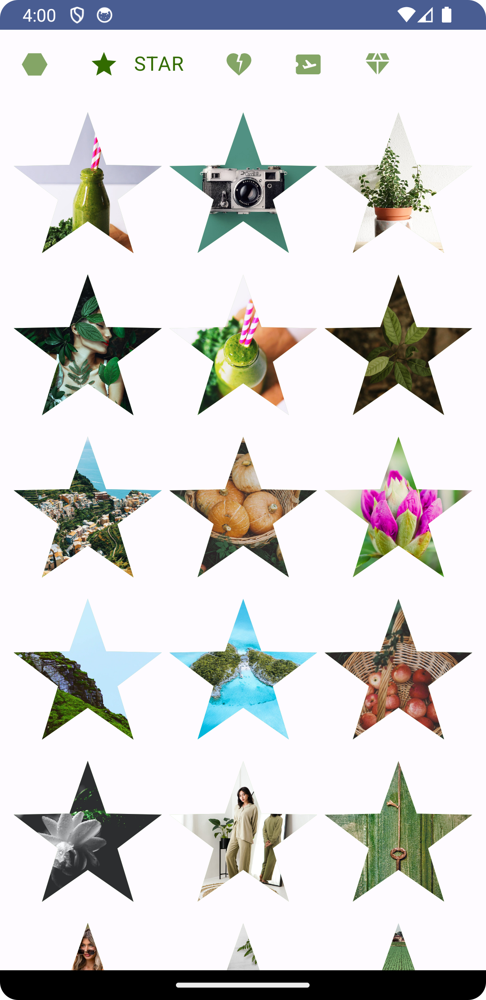
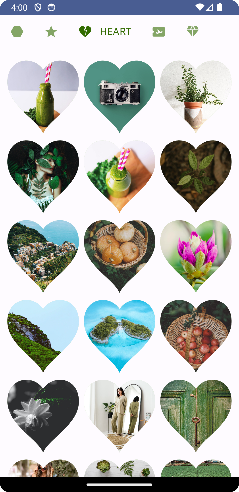
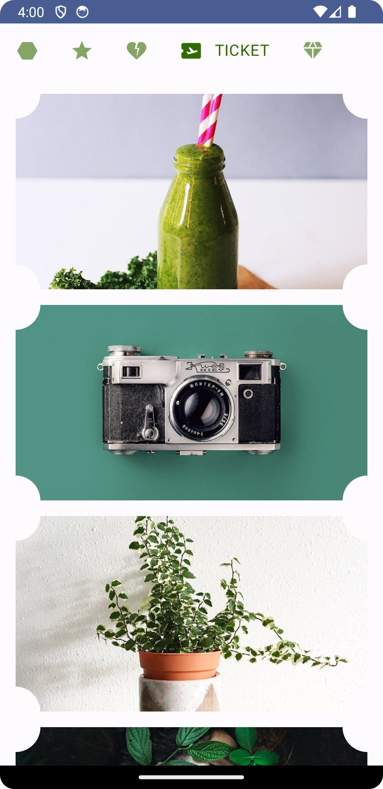
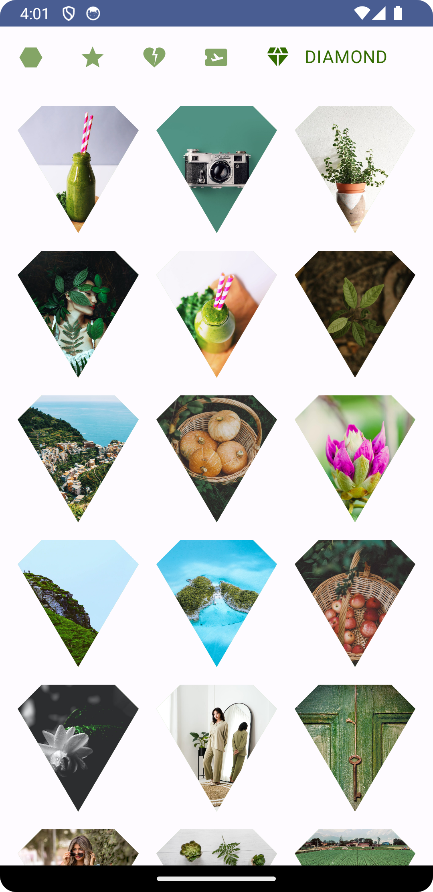

[](https://ktlint.github.io/)
[](https://developer.android.com/jetpack/compose)
[](https://kotlinlang.org/)
[](https://android-arsenal.com/api?level=21)
[](https://opensource.org/licenses/Apache-2.0)

<p align="center"> 
    
</p>

<h1 align="center"> Jetpack Compose Custom Shapes </h1>

Welcome to `Custom Shapes` - [Jetpack Compose](https://www.googleadservices.com/pagead/aclk?sa=L&ai=DChcSEwirxJ-8nJGAAxWezMIEHZm2DusYABACGgJwdg&ohost=www.google.com&cid=CAESa-D2E9EHPMO24ZVeohcQzPgBKtfVfkbnufBlV2qUiGJ5XL1vhNoQ7Yyk9acePAcC0Xrx3KvcDy_b5pvHL3nlRFYBNebz9_mLYiGTkq45DFvSST2UrzbFYFcZWc4RNKcXC6Bs884F7_fCsX0t&sig=AOD64_1j28Y5zCwhCJe_uPcFZYyLdXxP9Q&q&adurl&ved=2ahUKEwjD8Zm8nJGAAxXPFzQIHcrGDR4Q0Qx6BAgKEAE&nis=8), an open-source project focused on creating beautiful and unique custom shapes in Jetpack Compose. This project aims to provide a collection of custom shape implementations that you can easily integrate into your Compose projects, enabling you to design eye-catching and visually appealing UI elements.

Whether you are a beginner or an experienced Compose developer, this project offers a variety of pre-built shapes that can be utilized to enhance your app's user interface with creative and engaging designs.

## 🕹️ Features

**Hexagon:** Create hexagonal shapes with rounded corners and adjust the size according to your screen's dimensions.

**Star:** Design star shapes with a customizable number of points and inner radius for various star effects.

**Heart:** Craft heart shapes with smooth curves and adjusts the height and width as desired.

**Ticket:** Draw ticket shapes with rounded corners for visually appealing ticket-like elements.

**Diamond:** Create diamond shapes with straight lines for an elegant and modern appearance.

## 🌳 Environment
Android Studio verison used : ``Android Studio Hedgehog | 2023.1.1 Canary 11``

## 🖼️ Demo Screens

|Hexagon|Star|Heart|
|-|-|-|
| | ||

|Ticket|Diamond|
|-|-|
| | |

## 🖥️ Code Snippets
### 1. Hexagon
```
class HexagonShape : Shape {

    override fun createOutline(
        size: Size,
        layoutDirection: LayoutDirection,
        density: Density
    ): Outline {
        return Outline.Generic(
            path = drawCustomHexagonPath(size)
        )
    }
}

private fun drawCustomHexagonPath(size: Size): Path {
    return Path().apply {
        val radius = min(size.width / 2f, size.height / 2f)
        val triangleHeight = (sqrt(3.0) * radius / 2)
        val centerX = size.width / 2
        val centerY = size.height / 2

        moveTo(x = centerX, y = centerY + radius)
        lineTo(x = (centerX - triangleHeight).toFloat(), y = centerY + radius / 2)
        lineTo(x = (centerX - triangleHeight).toFloat(), y = centerY - radius / 2)
        lineTo(x = centerX, y = centerY - radius)
        lineTo(x = (centerX + triangleHeight).toFloat(), y = centerY - radius / 2)
        lineTo(x = (centerX + triangleHeight).toFloat(), y = centerY + radius / 2)

        close()
    }
}
```

### 2. Star
```
class StarShape : Shape {

    override fun createOutline(
        size: Size,
        layoutDirection: LayoutDirection,
        density: Density
    ): Outline {
        return Outline.Generic(
            path = drawStarPath(size)
        )
    }
}

private fun drawStarPath(size: Size): Path {
    return Path().apply {
        val numPoints = 5
        val centerX = size.width / 2f
        val centerY = size.height / 2f
        val outerRadius = min(size.width, size.height) / 2f
        val innerRadius = outerRadius / 2.5f // Adjust the inner radius as needed

        val doublePi = 2 * PI
        val angleIncrement = doublePi / numPoints

        var angle = -PI / 2f // Start angle at the top point of the star
        moveTo(
            x = (centerX + outerRadius * cos(angle)).toFloat(),
            y = (centerY + outerRadius * sin(angle)).toFloat()
        )

        // Draw the points of the star in the correct sequence
        for (i in 1..numPoints) {
            angle += angleIncrement / 2 // Move to the inner angle first
            lineTo(
                x = (centerX + innerRadius * cos(angle)).toFloat(),
                y = (centerY + innerRadius * sin(angle)).toFloat()
            )
            angle += angleIncrement / 2 // Move to the outer angle
            lineTo(
                x = (centerX + outerRadius * cos(angle)).toFloat(),
                y = (centerY + outerRadius * sin(angle)).toFloat()
            )
        }

        close()
    }
}
```

### 3. Heart
```
class HeartShape : Shape {

    override fun createOutline(
        size: Size,
        layoutDirection: LayoutDirection,
        density: Density
    ): Outline {
        return Outline.Generic(
            path = drawHeartPath(size)
        )
    }
}

private fun drawHeartPath(size: Size): Path {
    return Path().apply {
        val width: Float = size.width
        val height: Float = size.height

        // Starting point
        moveTo(x = width / 2, y = height / 5)

        // Upper left path
        cubicTo(
            x1 = 5 * width / 14, y1 = 0f,
            x2 = 0f, y2 = height / 15,
            x3 = width / 28, y3 = 2 * height / 5
        )

        // Lower left path
        cubicTo(
            x1 = width / 14, y1 = 2 * height / 3,
            x2 = 3 * width / 7, y2 = 5 * height / 6,
            x3 = width / 2, y3 = height
        )

        // Lower right path
        cubicTo(
            x1 = 4 * width / 7, y1 = 5 * height / 6,
            x2 = 13 * width / 14, y2 = 2 * height / 3,
            x3 = 27 * width / 28, y3 = 2 * height / 5
        )

        // Upper right path
        cubicTo(
            x1 = width, y1 = height / 15,
            x2 = 9 * width / 14, y2 = 0f,
            x3 = width / 2, y3 = height / 5
        )

        close()
    }
}
```

### 4. Ticket
```
class TicketShape : Shape {

    override fun createOutline(
        size: Size,
        layoutDirection: LayoutDirection,
        density: Density
    ): Outline {
        return Outline.Generic(
            path = drawTicketPath(size = size)
        )
    }
}

private fun drawTicketPath(size: Size): Path {
    return Path().apply {
        val cornerRadius = 70f
        // Top left arc
        arcTo(
            rect = Rect(
                left = -cornerRadius,
                top = -cornerRadius,
                right = cornerRadius,
                bottom = cornerRadius
            ),
            startAngleDegrees = 90.0f,
            sweepAngleDegrees = -90.0f,
            forceMoveTo = false
        )
        lineTo(x = size.width - cornerRadius, y = 0f)
        // Top right arc
        arcTo(
            rect = Rect(
                left = size.width - cornerRadius,
                top = -cornerRadius,
                right = size.width + cornerRadius,
                bottom = cornerRadius
            ),
            startAngleDegrees = 180.0f,
            sweepAngleDegrees = -90.0f,
            forceMoveTo = false
        )
        lineTo(x = size.width, y = size.height - cornerRadius)
        // Bottom right arc
        arcTo(
            rect = Rect(
                left = size.width - cornerRadius,
                top = size.height - cornerRadius,
                right = size.width + cornerRadius,
                bottom = size.height + cornerRadius
            ),
            startAngleDegrees = 270.0f,
            sweepAngleDegrees = -90.0f,
            forceMoveTo = false
        )
        lineTo(x = cornerRadius, y = size.height)
        // Bottom left arc
        arcTo(
            rect = Rect(
                left = -cornerRadius,
                top = size.height - cornerRadius,
                right = cornerRadius,
                bottom = size.height + cornerRadius
            ),
            startAngleDegrees = 0.0f,
            sweepAngleDegrees = -90.0f,
            forceMoveTo = false
        )
        lineTo(x = 0f, y = cornerRadius)

        close()
    }
}
```

### 5. Diamond
```
class DiamondShape : Shape {

    override fun createOutline(
        size: Size,
        layoutDirection: LayoutDirection,
        density: Density
    ): Outline {
        return Outline.Generic(
            path = drawDiamondPath(size)
        )
    }
}

private fun drawDiamondPath(size: Size): Path {
    return Path().apply {
        val centerX = size.width / 2f
        val diamondCurve = 60f
        val width = size.width
        val height = size.height

        moveTo(x = 0f + diamondCurve, y = 0f)
        lineTo(x = width - diamondCurve, y = 0f)
        lineTo(x = width, y = diamondCurve)
        lineTo(x = centerX, y = height)
        lineTo(x = 0f, y = diamondCurve)

        close()
    }
}
```

## 🔧 How to use these shapes
```
@Composable
fun Hexagon(modifier: Modifier = Modifier) {
    Box(
        modifier = modifier
            .clip(HexagonShape())
            .background(md_theme_light_inversePrimary),
        contentAlignment = Alignment.Center
    ) {
        
    }
}
```

## 🤝 Contributing

Contributions are what make the open-source community such a fantastic place to learn, inspire,
and create. Any contributions you make are **greatly appreciated**.

If you would like to contribute, please follow these steps:

1. Open an issue first to discuss what you would like to change.
2. Fork the Project
3. Create your feature branch (`git checkout -b feature/amazing-feature`)
4. Commit your changes (`git commit -m 'Add some amazing feature'`)
5. Push to the branch (`git push origin feature/amazing-feature`)
6. Open a pull request

Please make sure to update tests as appropriate.

## ✍️ Author


👤 **DawinderGill**

[](https://www.linkedin.com/in/dawinder-singh-gill-2b1833171)
[](https://play.google.com/store/apps/dev?id=6322881499451604311)
[](https://medium.com/@dawinderapps)

Feel free to ping me 😉


## 📝 License

```
Copyright © 2023 - DawinderGill
